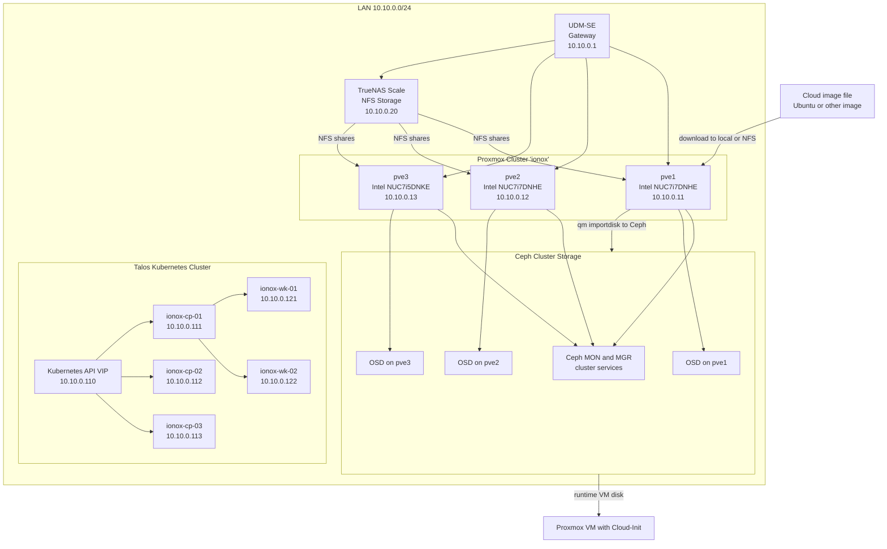

# IONOX – VM maken van een cloud image met Cloud-Init op Proxmox

## Huidige omgeving

Onderstaande tekening laat de huidige relevante omgeving zien voor deze handleiding: Proxmox nodes, Ceph, TrueNAS, netwerk en de staging- en runtime-stromen voor cloud images.



## Samenvatting van de omgeving

### Proxmox nodes

- `pve1` – `10.10.0.11`
- `pve2` – `10.10.0.12`
- `pve3` – `10.10.0.13`

### Storage

- **Local storage per node**
  - file-based
  - geschikt voor tijdelijke download of staging
- **TrueNAS NFS** – `10.10.0.20`
  - geschikt voor ISO, backups en staging
- **Ceph**
  - cluster-brede block storage
  - bedoeld voor runtime VM disks

### Kubernetes cluster op Proxmox

- API VIP – `10.10.0.110`
- `ionox-cp-01` – `10.10.0.111`
- `ionox-cp-02` – `10.10.0.112`
- `ionox-cp-03` – `10.10.0.113`
- `ionox-wk-01` – `10.10.0.121`
- `ionox-wk-02` – `10.10.0.122`

### Netwerk

- Gateway – `10.10.0.1`
- Standaard bridge in Proxmox – `vmbr0`

### Belangrijk voor deze handleiding

Voor deze flow gebruik je:

- **local of NFS** als plek om het imagebestand eerst neer te zetten
- **Ceph** als uiteindelijke storage voor de VM disk
- **Cloud-Init** voor user, SSH en netwerkconfiguratie

---

## Doel van deze handleiding

We maken handmatig en repliceerbaar een VM van een cloud image, zetten de disk op Ceph en configureren de eerste boot met Cloud-Init.

---

Deze handleiding is bedoeld om **repliceerbaar** een VM te maken van een **cloud image** in Proxmox, met de **disk op Ceph** en met **Cloud-Init** voor de eerste configuratie.

Deze versie gaat uit van deze aanpak:

- de cloud image staat eerst als bestand op een **file-based storage** zoals `local` of `NFS`
- daarna wordt de disk geïmporteerd naar **Ceph**
- daarna wordt de VM ingesteld met **Cloud-Init**

---

## Uitgangspunten

Vervang deze waarden als jouw omgeving anders is:

- **Node waarop je werkt:** `pve1`
- **VM ID:** `9000`
- **VM naam:** `ubuntu-2404-cloudinit`
- **Bridge:** `vmbr0`
- **Ceph storage naam:** `ceph-storage`
- **Staging storage voor download:** `local`
- **Image pad op local:** `/var/lib/vz/template/iso`
- **Cloud image URL:** Ubuntu 24.04 LTS

---

## Stap 1 – Download de cloud image naar een file-based storage

Begin **niet** met Ceph.

Een cloud image is eerst gewoon een bestand. Daarom download je die eerst naar een storage waar bestanden op mogen staan, zoals `local` of `NFS`.

Op `pve1`:

```bash
cd /var/lib/vz/template/iso
wget https://cloud-images.ubuntu.com/noble/current/noble-server-cloudimg-amd64.img
```

Controleer daarna of het bestand er staat:

```bash
ls -lh /var/lib/vz/template/iso/noble-server-cloudimg-amd64.img
```

---

## Stap 2 – Maak een lege VM aan

Maak nu eerst de VM-config aan. Deze stap maakt **nog geen bruikbare OS-disk** aan.

```bash
qm create 9000 \
  --name ubuntu-2404-cloudinit \
  --machine q35 \
  --bios ovmf \
  --memory 4096 \
  --cores 2 \
  --cpu host \
  --net0 virtio,bridge=vmbr0
```

---

## Stap 3 – Voeg EFI disk toe

Omdat we hier `OVMF` gebruiken, voeg je ook een EFI disk toe op Ceph.

```bash
qm set 9000 --efidisk0 ceph-storage:0,pre-enrolled-keys=0
```

---

## Stap 4 – Importeer de cloud image naar Ceph

Nu importeer je het imagebestand naar Ceph. Vanaf dit moment wordt de disk **cluster-breed bruikbaar**.

```bash
qm importdisk 9000 /var/lib/vz/template/iso/noble-server-cloudimg-amd64.img ceph-storage
```

Controleer daarna welke disknaam Proxmox heeft aangemaakt:

```bash
qm config 9000
```

Normaal zie je iets zoals:

```text
unused0: ceph-storage:vm-9000-disk-0
```

---

## Stap 5 – Koppel de geïmporteerde disk als systeemdisk

Koppel de disk die net als `unused0` is geïmporteerd.

```bash
qm set 9000 \
  --scsihw virtio-scsi-pci \
  --scsi0 ceph-storage:vm-9000-disk-0
```

---

## Stap 6 – Voeg Cloud-Init disk toe

Voeg nu de Cloud-Init disk toe, ook op Ceph.

```bash
qm set 9000 --ide2 ceph-storage:cloudinit
```

---

## Stap 7 – Stel bootvolgorde en console goed in

Cloud images werken het netst met seriële console.

```bash
qm set 9000 \
  --boot order=scsi0 \
  --serial0 socket \
  --vga serial0 \
  --agent enabled=1
```

---

## Stap 8 – Configureer Cloud-Init

Hier stel je de eerste login en netwerkconfiguratie in.

### Optie A – DHCP

```bash
qm set 9000 \
  --ciuser ubuntu \
  --ipconfig0 ip=dhcp
```

### SSH key toevoegen

Gebruik bij voorkeur een publieke SSH key:

```bash
qm set 9000 --sshkeys ~/.ssh/id_ed25519.pub
```

### Optioneel – wachtwoord instellen

Alleen doen als je dat echt wilt:

```bash
qm set 9000 --cipassword 'VervangDitDoorEenSterkWachtwoord'
```

### Optie B – vast IP

Als je liever een statisch IP gebruikt:

```bash
qm set 9000 --ipconfig0 ip=10.10.0.150/24,gw=10.10.0.1
```

---

## Stap 9 – Vergroot de disk als dat nodig is

Veel cloud images zijn klein. Vergroot de disk meteen naar een bruikbaar formaat.

Voorbeeld naar 40 GB:

```bash
qm resize 9000 scsi0 40G
```

---

## Stap 10 – Start de VM

```bash
qm start 9000
```

---

## Stap 11 – Controleer of Cloud-Init is toegepast

Bekijk eerst de VM-config:

```bash
qm config 9000
```

Bekijk daarna de console in Proxmox, of log in via SSH zodra het IP bekend is.

Bij DHCP kun je het IP vaak zien via de guest agent of in je DHCP-leases.

---

## Stap 12 – Test SSH login

Voorbeeld:

```bash
ssh ubuntu@10.10.0.150
```

Of met jouw key expliciet:

```bash
ssh -i ~/.ssh/id_ed25519 ubuntu@10.10.0.150
```

---

## Volledige commandoreeks

Als je alles achter elkaar wilt uitvoeren:

```bash
cd /var/lib/vz/template/iso
wget https://cloud-images.ubuntu.com/noble/current/noble-server-cloudimg-amd64.img

qm create 9000 \
  --name ubuntu-2404-cloudinit \
  --machine q35 \
  --bios ovmf \
  --memory 4096 \
  --cores 2 \
  --cpu host \
  --net0 virtio,bridge=vmbr0

qm set 9000 --efidisk0 ceph-storage:0,pre-enrolled-keys=0

qm importdisk 9000 /var/lib/vz/template/iso/noble-server-cloudimg-amd64.img ceph-storage

qm set 9000 \
  --scsihw virtio-scsi-pci \
  --scsi0 ceph-storage:vm-9000-disk-0

qm set 9000 --ide2 ceph-storage:cloudinit

qm set 9000 \
  --boot order=scsi0 \
  --serial0 socket \
  --vga serial0 \
  --agent enabled=1

qm set 9000 \
  --ciuser ubuntu \
  --ipconfig0 ip=dhcp

qm set 9000 --sshkeys ~/.ssh/id_ed25519.pub

qm resize 9000 scsi0 40G

qm start 9000
```

---

## Wat deze handleiding expres wel en niet doet

### Wel

- image eerst als bestand neerzetten
- daarna import naar Ceph
- daarna Cloud-Init correct koppelen
- daarna VM starten

### Niet

- geen template maken
- geen Terraform/OpenTofu gebruiken
- geen custom cloud-init snippets gebruiken

---

## Belangrijke notities

- `local` of `NFS` gebruik je hier alleen als **staging** voor het imagebestand
- de echte VM-disk staat daarna op **Ceph**
- de VM-config staat op de node waar je `qm create` uitvoert
- de disk staat cluster-breed op Ceph

---

## Snelle checks bij problemen

### Check of de image echt bestaat

```bash
ls -lh /var/lib/vz/template/iso/noble-server-cloudimg-amd64.img
```

### Check of de disk goed is geïmporteerd

```bash
qm config 9000
```

### Check of Ceph storage beschikbaar is

```bash
pvesm status
```

### Check Cloud-Init config

```bash
qm cloudinit dump 9000 user
```

---

## Volgende stap

Als deze handmatige flow werkt, dan zetten we **precies deze logica** om naar een **Terraform repo** met de bpg Proxmox provider.

